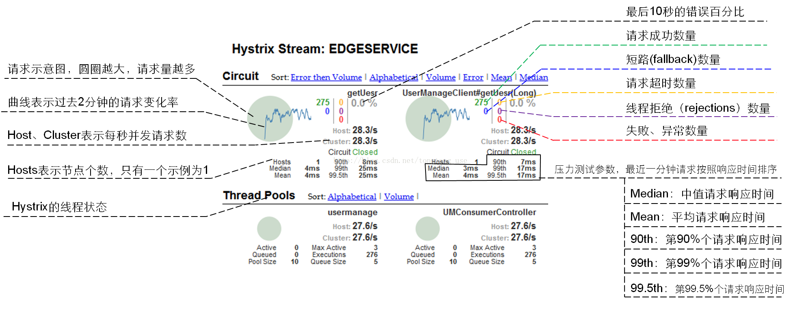

### Hystrix 仪表盘各元素含义 

- 实心圆： 共有两种含义。通过颜色的变化代表了实例的健康程度，它的健康度从绿色、黄色、橙色、红色递减。通过圆的大小来代表请求流量的大小，流量越大该实心圆就越大。所以通过该实心圆的展示，就可以在大量的实例中快速的发现故障实例和高压力实例。

- 曲线： 记录2分钟内流量的相对变化，可以通过它来观察到流量的上升和下降趋势。
其他数量指标如下图所示：

  